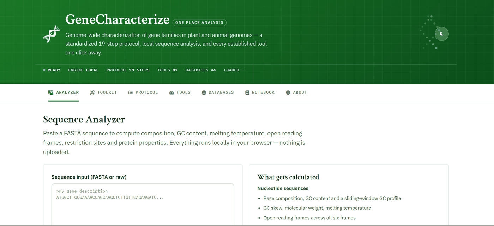

# GeneCharacterize

A browser-based gene characterization workbench. Sequence analysis runs locally in JavaScript;
a 19-step protocol organizes 87 external tools and 44 databases and hands your sequence to each
one; a built-in lab notebook records what you found and exports it as a formatted report.

**[Live demo](https://aryaadeshmukh-27.github.io/DNAcodes/)** ·
[Analysis engine](js/seqlib.js) · [Advanced tools](js/seqtools.js) · [Tests](tests/)


[](https://aryaadeshmukh-27.github.io/DNAcodes/)

---

## Why this exists

Characterizing a gene family means running the same sequence through a dozen web services —
BLAST, then InterPro, then MAFFT, then MEME, then PlantCARE — pasting the sequence into each
one, keeping track of where you are, and writing the results down somewhere. The basic numbers
you need along the way (GC content, ORF boundaries, molecular weight, pI) are simple enough to
compute directly, but usually mean opening yet another tool.

This project computes those numbers in the browser, turns the tool list into a navigable
protocol with the sequence carried along, and keeps a record you can export when you are done.

## Features

### Analyzer

Paste FASTA, get results immediately. No upload, no server.

| Nucleotide sequences | Protein sequences |
|---|---|
| Base composition, GC content, GC skew | Molecular weight, theoretical pI |
| Sliding-window GC profile | GRAVY score, Kyte-Doolittle hydropathy profile |
| Melting temperature (Wallace / GC formula) | Net charge at pH 7 |
| Six-frame ORF detection | Molar extinction coefficient at 280 nm |
| Restriction sites (16 enzymes) | Amino acid composition, aromaticity |
| Three-frame translation, reverse complement, codon usage | |

### Toolkit

- **Primer design** — candidate pairs screened on nearest-neighbour Tm (SantaLucia 1998), GC
  content, 3′ GC clamp, homopolymer runs and self-complementarity, then paired by Tm
  compatibility and product size.
- **Pairwise alignment** — Needleman-Wunsch global alignment, BLOSUM62 for proteins with
  automatic type detection, rendered in blocks with an identity midline.
- **Microsatellites** — SSR detection at the MISA thresholds (Thiel et al. 2003), the starting
  point for most molecular marker work.
- **Virtual digest** — cut with any of 16 enzymes, linear or circular, with fragment sizes shown
  on a simulated gel.

### Protocol, tools and databases

19 steps, each with practical guidance and the tools for that stage. Two kinds of hand-off:

- **Auto-fill** — NCBI BLAST, UniProt BLAST and NCBI CDD accept a sequence through their URL, so
  clicking through opens the tool with the query loaded and the right program and database
  selected for the sequence type.
- **Copy & go** — for the rest, the FASTA is copied to your clipboard and the tool opens at its
  input form.

The database browser covers 44 repositories across 7 categories, with direct search where the
site supports a documented query URL.

### Lab notebook

Record findings and notes against each step, save analyzer snapshots, then export the whole
thing as a printable HTML report, Markdown, or a JSON backup you can restore later. Stored in
`localStorage` — no account, no server.

## Running it

The multi-file version is a static site with no build step:

```bash
git clone https://github.com/aryaadeshmukh-27/DNAcodes.git
cd DNAcodes
python3 -m http.server 8000     # or: npx serve
```

Open <http://localhost:8000>.

To produce a single self-contained file you can open by double-clicking from anywhere:

```bash
npm run build          # writes dist/GeneCharacterize.html
```

## Tests

```bash
npm test               # or: node --test
```

197 tests across the three computation modules. Expected values are hand-calculable or published
reference figures rather than values copied out of the implementation — glycine at 75.07 Da,
glycylglycine at 132.12 Da, the Kyte-Doolittle index of isoleucine at 4.5, the Pace extinction
coefficients of 5500 (Trp) and 1490 (Tyr), the BLOSUM62 self-score of tryptophan at 11.

Many tests check invariants rather than fixed values, which catches a broader class of bug:

- Net charge decreases monotonically across the full pH range, and is approximately zero at the
  computed pI
- Reverse complement is its own inverse
- Removing gaps from an alignment recovers the input sequences exactly
- Digest fragment sizes sum to the sequence length, linear or circular
- Detected SSRs never overlap one another
- BLOSUM62 is symmetric across all 400 residue pairs
- Report generation escapes user input rather than injecting it

## Project structure

```
DNAcodes/
├── index.html              # markup and page shell
├── build.js                # bundles everything into one file
├── css/styles.css          # design tokens, layout, components, dark theme
├── js/
│   ├── seqlib.js           # core analysis — pure functions, no DOM
│   ├── seqtools.js         # primers, alignment, SSRs, digestion
│   ├── notebook.js         # notebook state and report generation
│   ├── databases.js        # registry of 44 databases
│   ├── tools-data.js       # registry of 87 tools across 19 steps
│   └── app.js              # UI, rendering, charts, tool hand-off
├── tests/                  # 197 unit tests
└── data/                   # example FASTA files
```

Computation is deliberately separated from the UI. Every function in `seqlib.js`,
`seqtools.js` and the report builders in `notebook.js` takes data and returns data with no DOM
access, which is what makes the test suite possible and lets the same code run in Node and in
the browser.

## Methods and limitations

Stated plainly, because a tool that hides its assumptions is worse than no tool.

- **Melting temperature** in the Analyzer uses the Wallace rule below 14 nt and the salt-adjusted
  GC formula above it. The primer designer uses nearest-neighbour thermodynamics, which is more
  accurate but still ignores mismatches and secondary structure.
- **Isoelectric point** is found by bisection on the Henderson-Hasselbalch charge curve using a
  standard pKa set. Implementations differ by a few tenths of a pH unit — cite ExPASy ProtParam
  for publication.
- **ORF detection** requires a canonical ATG start and the standard genetic code. It does not
  handle introns, alternative start codons, or organellar codon tables.
- **Primer design** does not check specificity against a genome. Always BLAST your primers.
- **Alignment** uses linear rather than affine gap penalties, and is capped at four million
  matrix cells to avoid locking up the browser. For publication use MAFFT or EMBOSS Needle.
- **Restriction analysis** covers 16 common enzymes and ignores methylation sensitivity and
  star activity.
- **GC content** excludes ambiguous bases from the denominator.

External links were verified on 2 August 2026. Predictions from linked services are predictions,
not evidence.

## Built with

Vanilla JavaScript, no framework. [Chart.js](https://www.chartjs.org/) for visualization is the
only runtime dependency. Tests use the Node.js built-in test runner, so there is no test
framework to install either.

## References

Methods implemented in the analysis engine:

- Needleman SB, Wunsch CD (1970). A general method applicable to the search for similarities in
  the amino acid sequence of two proteins. *J Mol Biol* 48:443–453.
- Wallace RB et al. (1979). Hybridization of synthetic oligodeoxyribonucleotides to φX174 DNA.
  *Nucleic Acids Res* 6:3543–3557.
- Howley PM, Israel MA, Law MF, Martin MA (1979). A rapid method for detecting and mapping
  homology between heterologous DNAs. *J Biol Chem* 254:4876–4883.
- Kyte J, Doolittle RF (1982). A simple method for displaying the hydropathic character of a
  protein. *J Mol Biol* 157:105–132.
- Henikoff S, Henikoff JG (1992). Amino acid substitution matrices from protein blocks.
  *PNAS* 89:10915–10919.
- Pace CN, Vajdos F, Fee L, Grimsley G, Gray T (1995). How to measure and predict the molar
  absorption coefficient of a protein. *Protein Sci* 4:2411–2423.
- SantaLucia J (1998). A unified view of polymer, dumbbell, and oligonucleotide DNA
  nearest-neighbor thermodynamics. *PNAS* 95:1460–1465.
- Thiel T, Michalek W, Varshney RK, Graner A (2003). Exploiting EST databases for the
  development of SSR markers in barley. *Theor Appl Genet* 106:411–422.

## Contributing

Issues and pull requests are welcome. If you are adding a calculation, please add tests for it
in `tests/` — the suite runs on every push via GitHub Actions and should stay green.

If a link in `js/tools-data.js` or `js/databases.js` has gone dead, that is a genuinely useful
issue to open. Web services move and the registry needs periodic checking.

## Author

Built by **Aryaa Deshmukh** ([@aryaadeshmukh-27](https://github.com/aryaadeshmukh-27)) — a
bioengineer decoding biology with code. This project sits where plant bioinformatics meets
web development: the algorithms are the interesting part, the browser is just a convenient
place to run them.

## License

MIT — see [LICENSE](LICENSE). You are free to use, modify and distribute this, including
commercially, provided the copyright notice is retained.

External tools and databases linked from this application are the property of their respective
maintainers and are subject to their own licences and terms of use.
